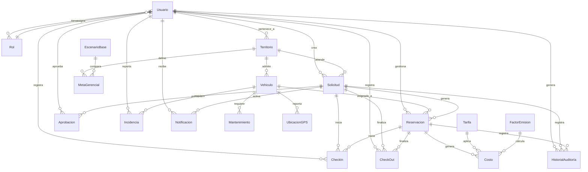

# Movilidad Corporativa — Diseño de referencia (MVP)

Este documento concentra los cinco entregables de diseño solicitados para construir la plataforma web responsive de Banorte. No incluye implementación de código; sirve como referencia base para los siguientes chunks:

1. Solicitud y comparación de alternativas
2. Aprobación y asignación inteligente
3. Check-in/check-out/incidencias
4. Operación y administración de flota
5. Analítica financiera/operativa/ambiental
6. Integraciones simuladas

---

## 1. Resumen de arquitectura propuesta

### Visión general
La solución se diseñará como una plataforma modular y extensible, separando la experiencia de usuario de la lógica de negocio y de la persistencia. La UI solo orquesta flujos, mientras que los motores de decisión y los repositorios quedan desacoplados.

### Stack recomendado
- Frontend: React + Next.js + TypeScript + Tailwind CSS
- Estado de UI: Zustand o React Context con patrones de dominio claros
- Servicios de negocio: capa de aplicación y dominio, implementada en TypeScript
- Persistencia: interfaz de repositorios con adaptadores locales primero
- Infraestructura futura: adaptadores para Firebase/Firestore, APIs internas o servicios SaaS

### Capas propuestas
- Capa de UI
  - Pantallas responsive para web escritorio/móvil
  - Formularios, listas, mapas, paneles y flujos de aprobación
  - Consumo de servicios de aplicación, no lógica de negocio directa

- Capa de servicios de negocio
  - Orquestación de casos de uso como “Crear solicitud”, “Comparar alternativas”, “Aprobar asignación”, “Registrar check-out”
  - Motores configurables e independientes:
    - Motor de asignación
    - Motor de costos
    - Motor de ahorros
    - Motor de emisiones

- Capa de repositorios de datos
  - Contratos de acceso a datos (interfaces) para usuarios, vehículos, solicitudes, reservas, incidencias, etc.
  - Adaptadores concretos para almacenamiento local inicial y sustitución futura por Firestore/Firebase sin tocar la UI

### Separación de motores como servicios configurables e independientes
Cada motor se modelará como un servicio con contrato explícito y reglas configurables:
- Motor de asignación
  - Decide entre Pool, Asignado Autorizado y Uber
  - Considera disponibilidad, compatibilidad, horario, territorio, políticas y límites configurables

- Motor de costos
  - Calcula costo estimado por alternativa
  - Evalúa comparativas entre modalidades y reglas de umbrales

- Motor de ahorros
  - Compara escenario base vs escenario optimizado
  - Genera métricas de ahorro financiero por solicitud, territorio o periodo

- Motor de emisiones
  - Estima emisiones por modalidad y compara el impacto ambiental del escenario optimizado

Estos servicios no dependerán de la UI. La UI solamente invoca una capa de casos de uso, y esa capa coordina los motores. La configuración de reglas se expondrá desde un modelo de negocio y/o catálogo de políticas, evitando hardcode en interfaces.

### Preparación para persistencia migrable
La persistencia se diseñará con puertos y adaptadores:
- Repositorios definidos por contrato (por ejemplo: VehículoRepository, SolicitudRepository)
- Adaptador inicial: almacenamiento local (IndexedDB/localStorage/mock de backend para MVP)
- Adaptador futuro: Firebase/Firestore

Esto permite que la UI siga igual aunque cambie la implementación subyacente. La migración implicará cambiar el adaptador, no reescribir pantallas ni reglas de negocio.

---

## 2. Entidades y relaciones (modelo de datos)

### Principios del modelo
- Cada entidad tiene ID único, timestamps de creación/actualización, usuario creador y estatus
- Las relaciones se resuelven por ID, no duplicando datos
- Todo cambio relevante queda registrado en HistorialAuditoría

### Diagrama entidad-relación (Mermaid)

### Entidades y campos clave

#### Usuario
- idUsuario
- nombreCompleto
- correoCorporativo
- empleadoId
- rolId
- territorioId
- telefono
- activo
- createdAt
- updatedAt
- createdBy
- status

#### Rol
- idRol
- nombreRol
- permisos
- createdAt
- updatedAt
- status

#### Territorio
- idTerritorio
- nombreTerritorio
- codigoTerritorio
- responsableId
- activo
- createdAt
- updatedAt
- status

#### Vehículo
- idVehiculo
- placa
- marcaModelo
- tipoVehiculo
- modalidadPoolAsignado (Pool / Asignado / UberSimulado)
- territorioId
- capacidadPasajeros
- combustibleTipo
- kilometrajeActual
- estadoOperativo
- disponibilidadActual
- costoPorKm
- factorEmisionId
- createdAt
- updatedAt
- createdBy
- status

#### Solicitud
- idSolicitud
- usuarioSolicitanteId
- territorioId
- fechaSolicitud
- horaInicioDeseada
- horaFinDeseada
- origen
- destino
- motivoViaje
- tipoViaje
- modalidadRequerida
- estadoSolicitud
- prioridad
- createdAt
- updatedAt
- createdBy
- status

#### Reservación
- idReservacion
- idSolicitud
- idVehiculo
- modalidadAsignada
- fechaInicio
- fechaFin
- costoEstimado
- costoReal
- estadoReservacion
- createdAt
- updatedAt
- createdBy
- status

#### Aprobación
- idAprobacion
- idSolicitud
- idAprobadorId
- decision
- comentario
- reglaAplicada
- fechaDecision
- createdAt
- updatedAt
- createdBy
- status

#### CheckIn
- idCheckIn
- idReservacion
- idUsuario
- fechaHoraCheckIn
- ubicacion
- observaciones
- createdAt
- updatedAt
- status

#### CheckOut
- idCheckOut
- idReservacion
- idUsuario
- fechaHoraCheckOut
- kilometrajeFinal
- combustibleRestante
- observaciones
- createdAt
- updatedAt
- status

#### Incidencia
- idIncidencia
- idReservacion
- idVehiculo
- idUsuarioReporta
- tipoIncidencia
- severidad
- descripcion
- evidenciaUrl
- estadoIncidencia
- createdAt
- updatedAt
- createdBy
- status

#### Mantenimiento
- idMantenimiento
- idVehiculo
- tipoMantenimiento
- fechaProgramada
- fechaRealizada
- costo
- responsable
- createdAt
- updatedAt
- createdBy
- status

#### UbicaciónGPS
- idUbicacionGPS
- idVehiculo
- latitud
- longitud
- timestampLectura
- velocidad
- estadoVehiculo
- createdAt
- updatedAt
- status

#### Tarifa
- idTarifa
- nombreTarifa
- modalidad
- costoBase
- costoPorKm
- costoPorHora
- vigenciaInicio
- vigenciaFin
- createdAt
- updatedAt
- status

#### Costo
- idCosto
- idReservacion
- idTarifa
- concepto
- monto
- moneda
- fechaAplicacion
- createdAt
- updatedAt
- status

#### FactorEmisión
- idFactorEmision
- modalidad
- unidad
- factor
- fuente
- vigenciaInicio
- vigenciaFin
- createdAt
- updatedAt
- status

#### EscenarioBase
- idEscenarioBase
- descripcion
- periodo
- costoBaseEstimado
- emisionesBaseEstimadas
- createdAt
- updatedAt
- status

#### MetaGerencial
- idMetaGerencial
- territorioId
- tipoMeta
- valorObjetivo
- periodo
- createdAt
- updatedAt
- status

#### Notificación
- idNotificacion
- idUsuarioDestino
- idSolicitud
- tipoNotificacion
- mensaje
- leida
- canal
- createdAt
- updatedAt
- status

#### HistorialAuditoría
- idHistorial
- entidad
- entidadId
- accion
- usuarioId
- cambiosJson
- fechaCambio
- createdAt
- updatedAt
- status

### Relación de negocio clave
- Un Usuario tiene un Rol y pertenece a un Territorio
- Un Vehículo pertenece a un Territorio
- Una Solicitud es creada por un Usuario y puede generar una Reservación
- Una Solicitud puede requerir una o más Aprobaciones
- Una Reservación se asocia a un Vehículo y puede tener CheckIn, CheckOut, Costos e Incidencias
- Todo cambio relevante queda registrado en HistorialAuditoría

---

## 3. Mapa de navegación

### Menú lateral colapsable
El menú se organizará por funciones y se mostrará de forma responsive, con grupos claros de navegación.

| Opción | Colaborador | Aprobador / Jefe | Administrador de flota | Ejecutivo / Gerente |
|---|---:|---:|---:|---:|
| Inicio | Sí | Sí | Sí | Sí |
| Nueva solicitud | Sí | Sí | Sí | Sí |
| Mis reservaciones | Sí | Sí | Sí | Sí |
| Aprobaciones | No | Sí | Sí | Sí |
| Operación de flota | No | Sí | Sí | Sí |
| Vehículos | No | No | Sí | Sí |
| Mapa | No | Sí | Sí | Sí |
| Incidencias | Sí | Sí | Sí | Sí |
| Analítica | No | No | Sí | Sí |
| Administración | No | No | Sí | Sí |

### Reglas de acceso por rol
- Colaborador
  - Puede crear solicitudes, ver sus reservas y reportar incidencias
  - No ve aprobaciones ajenas ni administración operativa

- Aprobador / Jefe
  - Ve sus aprobaciones pendientes y el panorama de operación de su territorio
  - Puede ver mapa, reservas y alertas relevantes

- Administrador de flota
  - Tiene acceso completo a operación, vehículos, incidencias, mantenimiento y administración

- Ejecutivo / Gerente
  - Ve analítica, metas, tendencias y control ejecutivo; puede supervisar operación en agregados

---

## 4. Fórmulas de costos, ahorros y emisiones

### Fórmulas base
- Costo por km = Costo total del medio / Km recorridos
  - Sirve para comparar la eficiencia por modalidad

- % por modalidad = Vehículos de la modalidad / Total de vehículos × 100
  - Permite medir evolución del mix Pool / Asignado

- Tasa de utilización = Horas utilizadas / Horas disponibles × 100
  - Indica qué tan bien se aprovecha la flotilla

- Ahorro generado = Costo estimado del escenario base − Costo real optimizado
  - Muestra el beneficio financiero del modelo recomendado

- CO₂ evitado = Emisiones estimadas del escenario base − Emisiones reales estimadas
  - Muestra el impacto ambiental del cambio de modalidad

### Reglas del comparador Pool / Asignado / Uber
La plataforma evaluará, por solicitud, la alternativa más conveniente según estas reglas:

1. Uber
   - Se selecciona si no hay disponibilidad compatible en Pool o Asignado
   - También si el costo de Uber es al menos un 10% menor que la alternativa terrestre disponible

2. Pool
   - Se selecciona si el vehículo Pool es compatible, está disponible y su costo es similar o menor que la alternativa asignada
   - Es la opción preferida cuando cumple con la disponibilidad y no genera sobrecostos relevantes

3. Asignado autorizado
   - Se usa cuando el vehículo asignado está disponible y cumple con la necesidad, y ofrece una relación costo/beneficio aceptable
   - Puede ser preferida cuando Pool no es viable o no resulta conveniente

4. Aprobación especial
   - Fuera de horario, en fin de semana o por encima de un límite configurable, se requiere aprobación especial
   - El motor de asignación debe marcar la solicitud como “requiere aprobación especial” cuando se cumpla la regla

### Explicación de negocio
Estas reglas permiten equilibrar eficiencia financiera, disponibilidad, política corporativa y sostenibilidad, evitando subutilización o uso fuera de horario sin control.

---

## 5. Integraciones simuladas en el MVP

### Integraciones a simular
Se priorizará el diseño de las integraciones como componentes simulados para no bloquear el MVP.

- GPS / telemática
  - Simular ubicación en tiempo real, estado de vehículo y disponibilidad
  - Mostrar estado “Simulado” en la UI

- Uber for Business
  - Simular cotización y disponibilidad de servicio alternativo
  - Mostrar la opción de Uber como alternativa calculada, no como integración real aún

- Login corporativo / SSO
  - Simular autenticación, roles y permisos de usuario corporativo
  - Mostrar identidad del usuario con un estado de “Simulación” en pantallas administrativas

- Correo
  - Simular confirmaciones, aprobaciones y recordatorios
  - Marcar visualmente el canal como “Integración simulada”

- Notificaciones
  - Simular alertas push/email/in-app para aprobaciones y cambios de estado

- Firma electrónica
  - Simular aprobación con firma digital o confirmación autorizada
  - En el MVP se presentará como flujo simulado de validación

- Almacenamiento de fotos
  - Simular carga y visualización de evidencia para incidencias o check-out

### Marca visual para el MVP
Todas las pantallas que dependan de una integración simulada deberán mostrar un badge o etiqueta visible:
- “Integración simulada”
- Color neutro o ámbar para diferenciarlo de flujos completos

### Punto de extensión en el código
El punto de extensión quedará en la capa de infraestructura/adaptadores, de forma independiente de la UI:
- Adaptadores por integración: GPSAdapter, UberAdapter, SsoAdapter, EmailAdapter, NotificationAdapter, SignatureAdapter, StorageAdapter
- Cada adapter expone la misma interfaz de contrato, aunque el MVP use una implementación simulada
- La UI consumirá servicios de aplicación que invocan estos adapters; así, cuando se conecte de verdad, solo se reemplaza la implementación concreta, no los flujos ni las pantallas

### Diseño de extensión futura
- Implementación actual: mock/fake provider
- Implementación futura: provider real de Firebase/Firestore o API externa
- El cambio se hará solo en la capa de infraestructura, manteniendo intacta la lógica de negocio

---

## Cierre de diseño
Este diseño establece una base consistente para construir la plataforma por módulos, con reglas de negocio desacopladas de la UI, un modelo de datos sólido y una estrategia de integración que no bloquee el MVP. El siguiente paso será implementar el primer chunk con enfoque en solicitud y comparación de alternativas, manteniendo estas decisiones como arquitectura de referencia.
